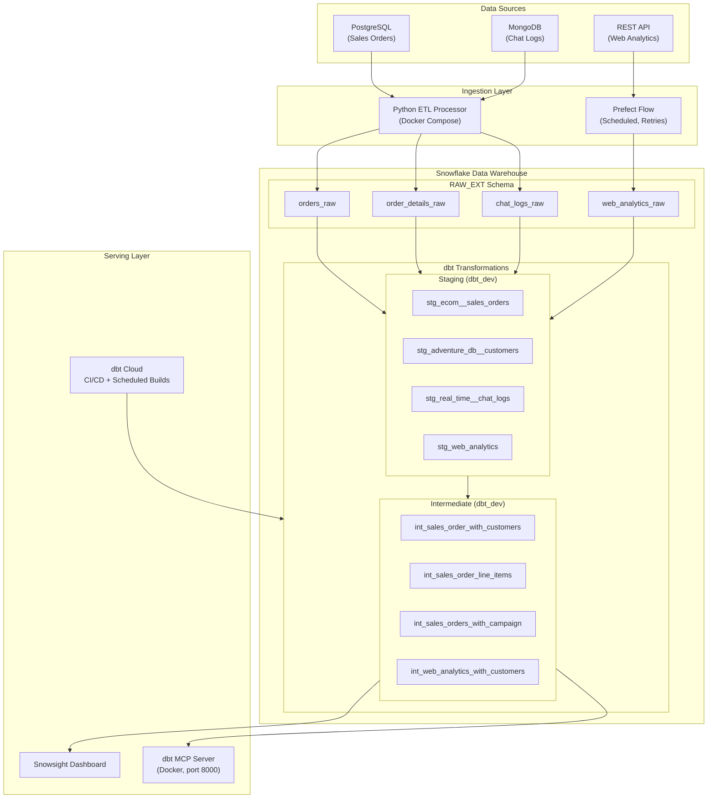

# Adventure Works Data Platform


> A production-style data platform that ingests from three heterogeneous sources (PostgreSQL, MongoDB, REST API), loads into Snowflake, transforms through dbt staging and intermediate layers with automated quality checks, orchestrates with Prefect, deploys via dbt Cloud CI/CD, and exposes models to AI agents through a dbt MCP server.

---

## Architecture



**Caption:** Data flows from three source systems through extraction and staging into Snowflake, is transformed through dbt's staging and intermediate layers, validated by 28 automated tests, and served to dashboards and AI agents. dbt Cloud provides daily scheduled builds and CI/CD on every pull request.

---

## Problem Statement

Adventure Works operates across three disconnected systems: a PostgreSQL database tracking real-time sales orders, a MongoDB store recording customer support chat logs, and a REST API streaming website clickstream events. Without a unified data platform, analysts cannot connect browsing behavior to purchasing patterns, marketing cannot attribute revenue to campaigns, and the business has no visibility into data quality or pipeline freshness. This platform extracts from all three sources, loads into a Snowflake cloud warehouse, and transforms the data into analytics-ready models with automated quality checks, giving stakeholders a single, trustworthy view of the business.

---

## Tech Stack

| Layer | Technology | Why |
|-------|-----------|-----|
| Source Systems | PostgreSQL, MongoDB, REST API | Represent the three dominant data paradigms in real-world companies: relational, document, and event/API. Handling all three demonstrates extraction from heterogeneous sources. |
| Extraction | Python ETL Processor | Custom processor uses watermark timestamps for incremental extraction, avoiding full-table scans. Snowflake's PUT + COPY INTO pattern is used for efficient bulk loading via internal stages. |
| Warehouse | Snowflake | Chosen for separation of compute and storage (warehouse can be suspended when idle), native VARIANT type for MongoDB JSON and nested order details, and COPY INTO for high-throughput bulk loading. |
| Transformation | dbt | SQL-based transformations with built-in testing, column-level documentation, lineage tracking, and version control. The `ref()` system enforces dependency ordering and makes the DAG explicit. |
| Orchestration | Prefect | Prefect 2.0 provides task-level retries with exponential backoff, structured logging, and a local UI, well suited for a single scheduled flow without the overhead of Airflow. |
| CI/CD | dbt Cloud + GitHub | Automated `dbt build` on every pull request catches regressions before merge. Daily scheduled production builds keep the `dbt_prod` schema current without manual intervention. |
| Agent Access | dbt MCP Server | Exposes dbt models, lineage, and compiled SQL to AI agents via the Model Context Protocol. Enables programmatic data discovery without custom API code. |
| Containerization | Docker Compose | All services (PostgreSQL, MongoDB, ETL processor, Prefect server/worker, MCP server) run in isolated containers with a single `docker compose up` command, making the environment fully reproducible. |

---

## Data Flow

**Ingestion:** The Python ETL processor (Milestone 1) runs in Docker Compose and extracts sales orders from PostgreSQL using watermark-based incremental pulls, and chat logs from MongoDB using a cursor on the `last_modified` field. Both sources are written to CSV/JSON, PUT to Snowflake internal stages, and loaded via `COPY INTO` into `RAW_EXT.orders_raw`, `order_details_raw`, and `chat_logs_raw`. The Prefect flow (Milestone 2) handles the third source: it fetches clickstream events from the Adventure Works web analytics REST API, validates and deduplicates records, then loads them into `RAW_EXT.web_analytics_raw` using the same PUT + COPY INTO pattern.

**Transformation:** dbt staging models clean and standardize each raw table by renaming columns, casting types, and adding metadata. `stg_ecom__sales_orders` unions the legacy PostgreSQL source with real-time MongoDB orders. `stg_real_time__chat_logs` parses Snowflake VARIANT JSON using colon notation. `stg_web_analytics` casts customer_id to VARCHAR for type-consistent joining. Intermediate models join across sources: `int_sales_order_with_customers` enriches orders with customer geography and contact info; `int_web_analytics_with_customers` enriches clickstream events with customer attributes via a LEFT JOIN that preserves all events even when customer_id falls outside the customer dimension.

**Serving:** Transformed intermediate models feed a Snowsight dashboard (Sales by Country) and are exposed to AI agents via the dbt MCP server running on port 8000 in Docker. dbt Cloud runs `dbt build` on a daily schedule in `dbt_prod` and on every GitHub pull request as a CI gate, ensuring no breaking changes reach production.

---

## Setup and Run

### Prerequisites

- Docker Desktop
- Snowflake account (trial works)
- Python 3.11+ and `uv` ([install guide](https://docs.astral.sh/uv/getting-started/installation/))
- dbt Cloud account (free tier)

### Quick Start

```bash
# 1. Clone the repository
git clone https://github.com/Opie22/DataEngineeringSeniorProject.git
cd DataEngineeringSeniorProject

# 2. Configure environment
cp .env.sample .env
# Edit .env with your Snowflake credentials and API URL

# 3. Run Snowflake DDL (one-time setup)
# Open Snowflake worksheet and run:
#   sql/snowflake_setup.sql        (Milestone 1 raw tables + stages)
#   prefect/snowflake_objects.sql  (Milestone 2 web analytics table + stage)

# 4. Start the core pipeline (Milestone 1)
docker compose up --build -d mongo postgres generator processor

# 5. Run dbt models and tests
cd dbt
set -a && source ../.env && set +a
uv sync
uv run dbt build

# 6. Start the Prefect flow (Milestone 2)
cd ..
docker compose up --build -d prefect-server prefect-worker web-analytics-flow
# View Prefect UI at http://localhost:4200

# 7. Start the MCP server (Milestone 3)
docker compose up --build -d dbt-mcp
# Verify: curl -s http://localhost:8000/sse | head -3

# 8. (Optional) Run the MCP demo client
cd mcp
uv sync
uv run python demo_client.py
```

### Environment Variables

| Variable | Description |
|----------|-------------|
| `SNOWFLAKE_ACCOUNT` | Full Snowflake account identifier (e.g., `ab12345.us-east-1`) |
| `SNOWFLAKE_USER` | Snowflake username |
| `SNOWFLAKE_PASSWORD` | Snowflake password |
| `SNOWFLAKE_WAREHOUSE` | Compute warehouse name (e.g., `COMPUTE_WH`) |
| `SNOWFLAKE_DATABASE` | Target database (e.g., `IS566`) |
| `SNOWFLAKE_ROLE` | Snowflake role (e.g., `ACCOUNTADMIN`) |
| `API_BASE_URL` | Web analytics API base URL |
| `PREFECT_API_URL` | Prefect server URL (use `http://prefect-server:4200/api` in Docker) |
| `FLOW_SCHEDULE_MINUTES` | How often the Prefect flow runs (e.g., `15`) |

See `.env.sample` for the full list with descriptions.

---

## Project Milestones

### Milestone 1: Core Pipeline

Built a containerized multi-source ETL pipeline extracting from PostgreSQL (sales orders with nested line items stored as JSON VARIANT) and MongoDB (customer chat logs as semi-structured documents). The Python processor uses watermark-based incremental extraction and loads via Snowflake's PUT + COPY INTO pattern. dbt models-m1 includes 14 models across base, staging, and intermediate layers covering sales orders, customers, inventory, vendors, products, email campaigns, purchase orders, and chat logs. The `int_sales_order_with_customers` intermediate model powers a Snowsight Sales by Country dashboard.

### Milestone 2: Orchestration, Quality, and Agent-Assisted Development

Added a third data source (REST API clickstream data) orchestrated by a Prefect 2.0 flow with four tasks: extract, validate, deduplicate, and load. The flow was built using a PRD-driven, AI-assisted process (Claude): I wrote [`prefect/prd.md`](prefect/prd.md) first to specify requirements before any code was generated, then directed the agent through structured implementation, overriding its initial DAG design (it omitted error handling and deduplication logic) and adding task-level retries manually. See [`prefect/agent_log.md`](prefect/agent_log.md) for the full interaction log including where AI output was corrected. Added dbt models-m2 (`stg_web_analytics`, `int_web_analytics_with_customers`) and 28 data quality tests including source freshness checks and two custom SQL tests. Deployed dbt Cloud with a daily scheduled build and a CI/CD job that runs `dbt build` on every pull request.

### Milestone 3: Agent Access and Portfolio

Deployed a dbt MCP server in Docker Compose exposing all 18 models to AI agents via the Model Context Protocol. Upgraded all dbt model and column descriptions to agent-friendly documentation (grain, business entity, join targets, edge cases). Implemented a Python demo client demonstrating 6 MCP capabilities: connection, tool discovery, model listing, node details, SQL compilation, and lineage tracing. See [`dbt/agent_access_reflection.md`](dbt/agent_access_reflection.md) for a critical reflection on agent data access patterns.

---

## Key Metrics

| Metric | Value |
|--------|-------|
| Data sources integrated | 3 (PostgreSQL, MongoDB, REST API) |
| Raw source tables | 4 (`orders_raw`, `order_details_raw`, `chat_logs_raw`, `web_analytics_raw`) |
| dbt models | 18 |
| dbt tests | 28 |
| Test pass rate | 100% (28/28) |
| Source freshness SLA | Warn at 12h, error at 24h |
| Models exposed via MCP | 18 |
| Prefect flow tasks | 4 (extract, validate, deduplicate, load) |
| Records per Prefect cycle | 50 events (from web analytics API) |
| Raw records in warehouse | 80,487 total (`orders_raw`: 16,100 · `order_details_raw`: 63,562 · `chat_logs_raw`: 278 · `web_analytics_raw`: 547) |

---

## What I Learned

Building this platform across three milestones taught me that data engineering is as much about contracts and documentation as it is about code. The MCP server exercise made this concrete. The quality of an AI agent's answers is determined by the quality of model descriptions. A vague `description: "Staging model"` produces guesses, while a description that states grain, join keys, and edge cases produces correct queries. I also learned that tooling compatibility is a constant source of friction in real pipelines: Python version constraints, dbt-fusion vs dbt-core differences, and dbt-mcp API changes between versions all required careful debugging. If I were starting over, I would more carefully define the environment constraints (Python version, package versions) up front in `pyproject.toml` before writing any code. The most valuable skill this project built was not any specific tool, but understanding each layer of the stack well enough to debug across them.

---

## Future Improvements

- **Streaming ingestion with Kafka:** The current Prefect flow polls the API on a fixed interval. A streaming approach using Kafka or Snowflake's Snowpipe would reduce latency from minutes to seconds for the web analytics pipeline.
- **dbt marts layer:** The current transformation stops at the intermediate layer. Adding a marts layer with pre-aggregated models (e.g., daily revenue by region, campaign conversion rates) would reduce query complexity for dashboard consumers and improve MCP agent response quality.
- **MCP access controls:** The current MCP server exposes all tools including `dbt run` and `dbt build`. A production deployment would restrict the exposed tool set to read-only operations and add Snowflake column-level masking for PII columns like `email_address` in `stg_adventure_db__customers`.

---

## Project Structure

```
DataEngineeringSeniorProject/
├── compose.yml                  # Docker Compose for all services
├── .env.sample                  # Environment variable template
├── Makefile                     # Standard dev commands
├── sql/
│   ├── create_raw_tables.sql    # Snowflake DDL for raw tables and stages
│   └── check_data_flow_queries.sql
├── processor/                   # Python ETL processor (Milestone 1)
│   ├── main.py                  # Entry point
│   ├── etl/
│   │   ├── extract.py           # Watermark-based extraction from PG + Mongo
│   │   └── load.py              # PUT + COPY INTO to Snowflake
│   └── utils/
│       ├── connections.py       # DB connection factories
│       ├── watermark.py         # Watermark state management
│       └── env_loader.py
├── prefect/                     # Prefect orchestration (Milestone 2)
│   ├── flows/
│   │   └── web_analytics_flow.py  # 4-task flow: extract → validate → dedup → load
│   ├── prd.md                   # Product requirements doc for the flow
│   └── agent_log.md             # AI-assisted development log
├── dbt/                         # dbt transformations
│   ├── models-m1/               # Milestone 1 models (staging + intermediate)
│   ├── models-m2/               # Milestone 2 models (web analytics)
│   ├── tests/                   # 6 custom SQL data quality tests
│   ├── seeds/                   # Reference data (measures, ship methods)
│   ├── analyses/                # Ad-hoc analytical queries
│   ├── AGENT_FRIENDLY_DOCS_GUIDE.md
│   └── agent_access_reflection.md
├── mcp/                         # dbt MCP server demo client (Milestone 3)
│   └── demo_client.py           # Demonstrates 6 MCP capabilities
├── screenshots/                 # Milestone evidence screenshots
└── technical_decisions.md       # Key architectural decision log
```

---

## Related Documentation

- [`technical_decisions.md`](technical_decisions.md): Key architectural decision log (watermarks, Prefect vs Airflow, COPY INTO, LEFT JOIN design, MCP approach)
- [`prefect/prd.md`](prefect/prd.md): Product Requirements Document for the web analytics Prefect flow
- [`prefect/agent_log.md`](prefect/agent_log.md): Agent interaction log for AI-assisted development
- [`dbt/agent_access_reflection.md`](dbt/agent_access_reflection.md): Reflection on agent data access patterns
- [`dbt/AGENT_FRIENDLY_DOCS_GUIDE.md`](dbt/AGENT_FRIENDLY_DOCS_GUIDE.md): Guide for writing agent-friendly dbt documentation
